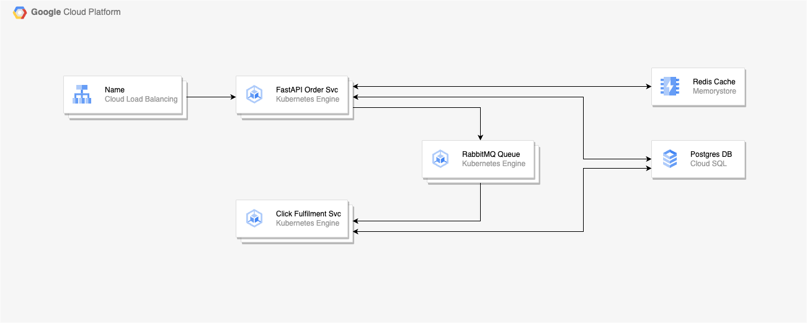

# Kubernetes Cluster Creation and FastAPI Deployment

This project facilitates the automated creation of a Kubernetes cluster on Google Cloud Platform (GCP) using Terraform and deploys a FastAPI application using Helm.



## Prerequisites

1. **Google Cloud SDK**: You must have the Google Cloud SDK installed and configured with appropriate permissions.

2. **Terraform**: Terraform version 0.13 or newer must be installed.

3. **kubectl**: Kubernetes command-line tool, kubectl, must be installed.

4. **Helm**: Helm version 3 or newer must be installed.

5. **Docker**: If you want to build the container image locally, you will need Docker installed. Code can be found [here](https://github.com/FirneyGroup/fastapi-docker)

## Setup

### 1. Google Cloud Configuration

Ensure you have the appropriate permissions and set the necessary environment variables:

```bash
gcloud auth login
gcloud auth application-default login
```

### 2. Terraform Variable Configuration

Navigate to the vars directory then copy and update the tfvars file

```bash
cd vars
cp example.tfvars dev.tfvars
```

### 3. Terraform Initialisation and Cluster Creation

Navigate to the Terraform directory and run the following commands to initialise and create the cluster:

```bash
cd ../terraform
terraform init
terraform apply -var-file=../vars/dev.tfvars
```

By following these commands, Terraform will initialse the configuration within the directory and apply the defined plan. It will create a Kubernetes cluster on Google Cloud Platform using the specifications defined in your Terraform files. Ensure that the variables within the Terraform vars files are properly set up to match your desired cluster configuration.

### 4. Helm Chart Configuration
Make sure your Kubernetes cluster is configured as the current context for kubectl, then navigate to the Helm chart directory, copy and update the helm values to match your configuration (Redis IP, SQL IP, etc).

```bash
cd ../helm/charts/
cp values.yaml.example values.yaml
```

### 5. FastAPI Deployment
Deploy the FastAPI application using Helm:


```bash
helm install firney-workshop .
```

### Usage
Your FastAPI application will be available at the load balancer's IP address, which you can find using.

```bash
kubectl get ingress -n workshop
```

If you would like to test your new api you can downlaod our postman collection [here](https://raw.githubusercontent.com/FirneyGroup/fastapi-docker/main/Public.postman_collection.json)

### Customisation

You can customise various parameters of both the Kubernetes cluster and the FastAPI application by modifying the respective Terraform and Helm configuration files.

### Cleaning Up
To destroy the created resources:

```bash
helm uninstall firney-workshop
cd ../../terraform
terraform destroy -var-file=../vars/dev.tfvars
```
